# ptflow · pipeline external — mappa concettuale (flowchart)

> **Auto-generata** da `ptflow.core.flowdocs` — **non modificare a mano**: un hook la
> rigenera a ogni modifica sotto `src/ptflow/pipelines/`, quindi i comandi e l'ordine qui sotto
> seguono il codice. Versione interattiva pan/zoom: [`external-pipeline-map.html`](external-pipeline-map.html).
> Spec dettagliata per-step (summary/output/note): [`external-pipeline-flow.html`](external-pipeline-flow.html).

```mermaid
flowchart TD
scope(["scope.txt"])
subgraph BREADTH["① BREADTH · activity scope — una volta su tutto lo scope"]
direction TB
provision_wl["provision_wl  ·  net=False<br># wordlists.provision() — un symlink wl_global/&lt;role&gt;.txt per ruolo risolto"]
expand["expand<br>mapcidr -silent                                  # espande i CIDR<br>naabu -top-ports 1000 -exclude-cdn -c 50 -rate 1000   # porte per harvest TLS (rate=profilo)<br>tlsx -san -cn -resp-only  →  dnsx -silent        # nomi dai cert → risolti<br>dnsx -ptr -resp-only                             # PTR sugli IP<br>assetfinder -subs-only    subfinder -silent      # enum delle wildcard"]
resolve["resolve<br>shuffledns -mode resolve -r resolvers-trusted    # fallback: dnsx -silent<br>dnsx -a -resp-only -silent                       # → unique_ips<br>dnsx -a -resp -nc -silent                        # → domain_ip_map"]
scope_gate["scope_gate  ·  net=False<br># build_allowlist(scope_init) + filter_assets(subdomains + tls_names, domain_ip_map, unique_ips)<br># offline (net=False) · complementa naabu -exclude-cdn / split_cdn_ip_records (niente check CDN qui)"]
portscan["portscan<br>naabu -p &lt;~250 WEB_PORTS&gt; -exclude-cdn -c 50 -rate 1000   # rate=profilo<br># → honeypot_split (≥15 porte aperte = honeypot) + select_web_ports"]
httpx["httpx<br>httpx -sc -cl -td -title -ip -hash sha256<br>      -favicon -location -fr -irh -nf -j   # -nf: probe http+https (alt TLS ports)<br>split_cdn_ip_records → drop bare-IP CDN/cloud/WAF (→ excluded_cdn.jsonl)"]
end
scope -.->|∥ offline| provision_wl
scope --> expand
expand --> resolve
resolve --> scope_gate
scope_gate --> portscan
portscan --> httpx
CLUSTER{{"② CLUSTER · pivot fan-out<br>→ scans/&lt;app_id&gt;/"}}
BREADTH ==> CLUSTER
subgraph SPAN["SPANNING · ∥ cluster + tutti i loop — join al fan-in"]
direction TB
portscan_full["portscan_full<br>naabu -top-ports full -exclude-cdn -c 50 -rate 1000   # rate=profilo"]
nerva["nerva<br>nerva --json"]
nuclei_scope["nuclei_scope<br># template aggiornati/pinnati fuori dalla run (nessuna race con i pass DAST)<br>nuclei -stats -nmhe -c 25 -bs 25 -rl 150 -timeout 10 -retries 2 -j -silent -duc"]
end
portscan -.->|∥| portscan_full
portscan_full --> nerva
httpx -.->|∥| nuclei_scope
screenshot["screenshot<br>httpx -ss -system-chrome -no-screenshot-full-page -st 20 -srd &lt;screenshots&gt; -svrc<br>      -sc -cl -title -td -server -ip -favicon -location -irh -j   # fingerprint (-j)<br>eyewitness --web -f &lt;1 url/gruppo&gt; -d &lt;out&gt; --no-prompt --timeout 15   # opzionale"]
CLUSTER -.->|∥ loop| screenshot
subgraph P1["③ PER-APP · FASE 1 · surface recon"]
direction TB
passive_probe["passive_probe<br>gau --threads 5     urlfinder -silent"]
crawl["crawl<br>katana -j -jc -jsl -kf all -fx -xhr -pc -fs fqdn -d 3 -c 2 -omit-body -srd responses/ [-H auth:webscan]<br>crawley -headless -depth 3 -workers 15 -all -js -robots crawl [-header auth:webscan]   # per host<br># classify: &lt;a href&gt; raw + crawley vs fx-parsato (+ thin-shell) → crawl_class.json<br># parse_katana_requests → requests_crawl.jsonl (method/body/form/xhr, non solo URL)"]
crawl_headless["crawl_headless<br>katana -hl -nos -jc -jsl -xhr -fx -iqp -fs fqdn -d 3 -c 5 -ct 180 -rl 50 -srd responses/headless/ [-H auth:webscan]<br># parse_katana_requests → requests_headless.jsonl (XHR/fetch POST/JSON della SPA)"]
subenum["subenum<br>subfinder -silent     dnsx -silent"]
takeover["takeover<br>subjack -w &lt;candidates&gt; -t 100 -timeout 30 -ssl"]
fetch_delta["fetch_delta<br>httpx -srd responses/osint/ -rl 50   # passive_delta = sorgenti - responses/index<br># + _sourcemap_fetch_targets: i .map (non-inline) referenziati dai JS dello store"]
api_spec["api_spec<br>httpx -srd store/ -mc 200   # sonda ~10 path spec noti (/openapi.json, /swagger.json, /v3/api-docs…)<br># expand_openapi: ogni operazione (path x metodo) → richiesta (path-param '1', query/header,<br>#   requestBody/in:body → skeleton JSON|urlencoded), cap API_SPEC_MAX_OPS=300<br>httpx -mc 200,400,405      # endpoint GraphQL → richiesta POST-json ({query:{__typename}})"]
mine_responses["mine_responses  ·  net=False<br>jsluice urls &lt;js dello store + sorgenti da sourcemap&gt;   # → endpoints_js.txt<br># _reconstruct_sourcemaps: .map (fetchati) + data: inline → raw/extracted/sourcemap/*.js<br># parse_sourcemap: sourcesContent → sorgenti de-bundlati (endpoint + secret fleet li vedono)"]
request_catalog["request_catalog  ·  net=False<br># 1) record richiesta: requests_crawl + requests_headless + requests_api<br># 2) SHAPE minati offline dal corpus crawl (fetch once — i body sono già su disco):<br>#    jsluice_requests(JS) → metodo/contentType/bodyParams di fetch/XHR · html_form_requests(HTML)<br>#    → form POST/GET; url relative risolte sull'URL sorgente del body (stem→url dagli index -srd)<br># 3) endpoint URL-only come GET di fallback · scheme raggiungibile (_working_schemes) · in-scope<br># dedup per shape (request_key = metodo + path-template) → merge_requests<br># 4) DROP delle shape GET il cui path il corpus ha visto SOLO come 404/410 (dead_url_keys)"]
end
passive_probe --> crawl
crawl --> crawl_headless
crawl --> takeover
subenum --> takeover
crawl_headless --> fetch_delta
fetch_delta --> mine_responses
crawl_headless --> request_catalog
mine_responses --> request_catalog
api_spec --> request_catalog
CLUSTER ==> P1
BAR2[["━━ BARRIERA: FASE 1 → FASE 2 ━━"]]
P1 ==> BAR2
subgraph P2["FASE 2 · DAST surface"]
direction TB
xref_catalog["xref_catalog  ·  net=False<br># _cross_group_surface(activity, ws): dagli ALTRI gruppi le richieste/endpoint con host ∈ ws.hosts<br>#   (taggate xref:&lt;origine&gt;) → _finalize_catalog (scheme raggiungibile · in-scope · dead-drop 404)"]
dast["dast<br># input: requests.jsonl (parametri osservati), dedup per shape, cap DAST_MAX_REQUESTS=1500<br># tutti i template di tutti i pack abilitati; selezione esatta nel manifest<br>#   → raw/dast/input.jsonl + raw/dast/template-selection.json<br>nuclei -dast -im jsonl -l input.jsonl -t &lt;pack&gt;...<br>       -fa high -fuzz-param-frequency 10000 -rl &lt;profilo&gt; -c &lt;profilo&gt;<br>       -timeout 10 -retries 2 -j -silent -duc [-H auth]<br># dedup_dast_findings: 1 record per (template, host, path, fuzz position) — collassa i re-fire<br>#   dello stesso punto di iniezione (varianti sintetizzate, http+https) su UN solo finding"]
xss["xss<br># candidati = request parametrizzati del catalogo superficie (cap VULN_MAX_REQUESTS=40)<br>dalfox file &lt;raw&gt; --rawdata --format jsonl --skip-bav -w 30 --timeout 10 [--http] [-H auth]<br># 1 processo per request (raw Burp/ZAP) → testa query/body/json/header, non solo GET<br># PTFLOW_OAST=on: interactsh-client per il pass + -b https://b&lt;i&gt;.&lt;domain&gt; (callback per-request)<br>#   → correlate_oast: full-id &lt;marker&gt;.&lt;uid&gt; → request → finding poc_kind:blind (solo sincroni)"]
sqli["sqli<br># candidati = request parametrizzati del catalogo superficie (cap VULN_MAX_REQUESTS=40)<br>sqlmap -r &lt;raw&gt; --batch --smart --level 1 --risk 1 --threads 4 --disable-coloring [-H auth]<br># 1 processo per request · --smart = test pesanti solo su euristica positiva (politeness)"]
cve_lookup["cve_lookup  ·  net=False<br># software = collect_software(tech, Server header, banner nerva, lib del corpus) — solo con versione<br>search_vulns -q '&lt;Prodotto Versione&gt;' -f json --ignore-general-product-vulns --use-created-product-ids<br># --use-created-product-ids: product ID alla versione ESATTA (no ladder) · cache memo process-wide · offline DB locale"]
end
xref_catalog --> dast
xref_catalog --> xss
xref_catalog --> sqli
BAR2 ==> P2
subgraph CP2["CHECKPOINT · DOPO FASE 2"]
direction TB
surface_checkpoint["surface_checkpoint  ·  net=False<br># fan-in parziale offline: cve/dast/xss/sqli di superficie + takeover della fase 1<br># reporting.write_report(..., stem='report-surface')"]
end
P2 ==> CP2
BAR3[["━━ BARRIERA: FASE 2 → FASE 3 ━━"]]
CP2 ==> BAR3
subgraph P3["FASE 3 · fuzzing/guessing"]
direction TB
wordlist["wordlist  ·  net=False<br>tokenize_urls(endpoints + headless + js)            # → seed.txt<br>extract_param_names(query keys + jsluice q/bodyParams + form name= + JSON keys)  # → params.txt<br>extract_value_words(query values + app-name + tech/header + apex)                # → values.txt<br>extract_identities(email regex + mailto + local-part + campi user/owner/…)       # → identities.txt"]
tech_enum["tech_enum<br>shortutil wordlist &lt;seed + global content&gt; &gt; rainbow.txt<br>shortscan -o json -a auto -w rainbow.txt -c 20 @hosts"]
content_discovery["content_discovery<br># Pass A round 0 (wordlist STAGED: build_content_wordlist):<br>feroxbuster --smart -k -t 5 -L 2 -d 2 --timeout 15 --time-limit 20m -w round0.txt [-x exts]<br># feedback round (fuzza SOLO i token NUOVI):<br>feroxbuster --smart … --time-limit 5m -w round&lt;r&gt;.txt<br>httpx -srd responses/discovered/round&lt;r&gt;/ -rl 50   # scarica i nuovi hit 2xx/3xx<br>jsluice urls &lt;new-js&gt;                              # mina → cresce la frontiera<br># stage 3 deep dive (OPT-IN PTFLOW_DEEP_DIVE, solo host high-value):<br>feroxbuster --smart … -d 3 --time-limit 30m -w deepdive&lt;i&gt;.txt   # mn_php/mn_phpmillion/mn_html<br># poi UNA volta sul corpus completo, secret fleet ∥:<br>jsluice secrets ∥ gitleaks ∥ trufflehog --results=verified ∥ detect-secrets"]
recrawl["recrawl<br># select_recrawl_seeds: hit 2xx il cui PRIMO SEGMENTO di path nessun URL crawlato usa<br>#   (covered = (host, primo-segmento) di endpoints.txt+headless+store) → 1 seed shallow/segmento nuovo<br># PTFLOW_RECRAWL: off | preview (scrive raw/recrawl/seeds.txt, NON crawla) | on (default: crawla)<br>katana -jc -jsl -kf all -fx -xhr -fs fqdn -d 2 -c 2 -ct 120 -omit-body -srd responses/recrawl/ [-H auth]"]
cloud_assets["cloud_assets<br># passive: parse_cloud_refs(corpus body + URL dello store) → bucket S3/GCS/Azure referenziati<br># candidati: bucket_candidates(apex) → &lt;label&gt;{,-assets,-dev,-backups,…} su S3 + GCS<br>httpx -mr 'ListBucketResult|EnumerationResults|&lt;Contents&gt;|storage#objects'   # → public (high)<br>httpx -mc 403   # → exists-but-private (info) · memoizzato per URL bucket process-wide"]
end
wordlist --> tech_enum
wordlist --> content_discovery
tech_enum --> content_discovery
content_discovery --> recrawl
BAR3 ==> P3
BAR4[["━━ BARRIERA: FASE 3 → FASE 4 ━━"]]
P3 ==> BAR4
subgraph P4["FASE 4 · DAST deep"]
direction TB
request_catalog_full["request_catalog_full  ·  net=False<br># _assemble_catalog(include_guessed=True): requests_crawl/headless/api + requests_recrawl<br>#   + shape minati dal corpus completo + endpoint URL-only (incl. content_discovery 2xx) come GET<br>#   + endpoint scoperti in ALTRI gruppi in-scope che appartengono a questo host (routing xref:&lt;origin&gt;)<br># dedup per shape (request_key = metodo + path-template) → merge_requests · scheme raggiungibile · in-scope<br># DROP delle shape GET dead/404 (dead_url_keys, sul corpus ora esteso da content_discovery/recrawl)"]
param_fuzz["param_fuzz<br># query: ogni shape (dedup path-template, cap 50) · body+json: endpoint con body (form/xhr/POST,<br>#   cap 25, + probe sui GET) · header: subset (cap 15, solo x8). wordlist params custom-first.<br>arjun -i targets_&lt;loc&gt;.txt -oJ &lt;loc&gt;.json -m GET|POST|JSON -t 5 -T 15 --rate-limit 20 -q [--headers auth]<br>x8 -u targets_&lt;loc&gt;.txt -w params -O json -o &lt;loc&gt;.json [-X POST] [-t json] [--headers] [-H auth]<br># matrice (tool, location) in un pool cappato (PARAM_FANOUT=3); cap wall-clock per-tool 600s<br># collapse_global_params: un param trovato su ≥75% degli endpoint testati (≥5) = riflesso<br>#   SITE-WIDE → 1 record host-level {scope:site-wide}, non sprayato su ogni endpoint"]
dast_full["dast_full<br># delta = shape in requests_full.jsonl NON già in requests.jsonl (request_key) + build_fuzz_requests(params)<br># tutti i template dei pack abilitati; cap 1500 → input_full + template-selection-full.json<br>nuclei -dast -im jsonl -l input_full.jsonl -t &lt;pack&gt;...<br>       -fa high -fuzz-param-frequency 10000 -rl &lt;profilo&gt; -c &lt;profilo&gt;<br>       -timeout 10 -retries 2 -j -silent -duc [-H auth]<br># dedup_dast_findings: 1 record per (template, host, path, fuzz position), come in dast"]
xss_full["xss_full<br># candidati = request parametrizzati del DELTA + build_fuzz_requests(params) (cap VULN_MAX_REQUESTS)<br>dalfox file &lt;raw&gt; --rawdata --format jsonl --skip-bav -w 30 --timeout 10 [--http] [-H auth]"]
sqli_full["sqli_full<br># candidati = request parametrizzati del DELTA + build_fuzz_requests(params) (cap VULN_MAX_REQUESTS)<br>sqlmap -r &lt;raw&gt; --batch --smart --level 1 --risk 1 --threads 4 --disable-coloring [-H auth]"]
cve_lookup_full["cve_lookup_full  ·  net=False<br># stessa correlazione offline di cve_lookup, sul corpus ora esteso<br>search_vulns -q '&lt;Prodotto Versione&gt;' -f json --ignore-general-product-vulns<br># delta = (prodotto,versione) NON in raw/cve/seen.txt · cache memo condivisa con la passata FASE 2"]
tech_vulnscan["tech_vulnscan<br># gate: meta.tech contiene 'wordpress' (match a parola intera) · 1 scan stealthy per host (-body-dedup)<br>wpprobe scan -u &lt;host&gt; -o raw/wpprobe/scanN.json --rate-limit 20 -t 5 [-H &lt;auth:webscan&gt;]<br># parse_wpprobe: un finding per (componente,versione,CVE) · ordinati per severità/CVSS"]
end
request_catalog_full --> param_fuzz
request_catalog_full --> dast_full
param_fuzz --> dast_full
request_catalog_full --> xss_full
param_fuzz --> xss_full
request_catalog_full --> sqli_full
param_fuzz --> sqli_full
BAR4 ==> P4
FANIN[["④ FAN-IN · consolidate<br>findings/&lt;tipo&gt;.jsonl"]]
P4 ==> FANIN
nerva -.->|join| FANIN
nuclei_scope -.->|join| FANIN
screenshot -.->|join| FANIN
classDef breadth fill:#0d2f54,stroke:#4f9be6,color:#dbe9fb;
classDef span fill:#2e2147,stroke:#a98ee0,color:#ece4fb;
classDef pivot fill:#073b42,stroke:#34d3e6,color:#d6fbff;
classDef bar fill:#3a424c,stroke:#8a96a3,color:#eef2f6,font-weight:bold;
classDef fanin fill:#10331c,stroke:#54d07a,color:#dcf6e3,font-weight:bold;
classDef checkpoint fill:#3a2f06,stroke:#e6c247,color:#f8edc2,font-weight:bold;
classDef phase1 fill:#10331c,stroke:#4cc46b,color:#dcf6e3;
classDef phase2 fill:#3a2f06,stroke:#e6c247,color:#f8edc2;
classDef phase3 fill:#3a0f23,stroke:#ef6a9b,color:#fbd9e6;
classDef phase4 fill:#3a1a08,stroke:#f08a4c,color:#fbe2d2;
class provision_wl,expand,resolve,scope_gate,portscan,httpx breadth
class portscan_full,nerva,nuclei_scope,screenshot span
class surface_checkpoint checkpoint
class passive_probe,crawl,crawl_headless,subenum,takeover,fetch_delta,api_spec,mine_responses,request_catalog phase1
class xref_catalog,dast,xss,sqli,cve_lookup phase2
class wordlist,tech_enum,content_discovery,recrawl,cloud_assets phase3
class request_catalog_full,param_fuzz,dast_full,xss_full,sqli_full,cve_lookup_full,tech_vulnscan phase4
class CLUSTER pivot
class BAR2,BAR3,BAR4 bar
class FANIN fanin
```

