# ptflow · pipeline internal — mappa concettuale (flowchart)

> **Auto-generata** da `ptflow.core.flowdocs` — **non modificare a mano**: un hook la
> rigenera a ogni modifica sotto `src/ptflow/pipelines/`, quindi i comandi e l'ordine qui sotto
> seguono il codice. Versione interattiva pan/zoom: [`internal-pipeline-map.html`](internal-pipeline-map.html).
> Spec dettagliata per-step (summary/output/note): [`internal-pipeline-flow.html`](internal-pipeline-flow.html).

```mermaid
flowchart TD
scope(["scope.txt"])
subgraph BREADTH["① BREADTH · activity scope — una volta su tutto lo scope"]
direction TB
expand["expand  ·  net=False<br>mapcidr -silent   # ogni CIDR → IP · scope IP passthrough se mapcidr assente"]
discover["discover<br>nmap -sn -n -oG - -iL -   # parse_nmap_up: le righe 'Status: Up'"]
portscan["portscan<br>naabu -silent -p &lt;INTERNAL_PORTS&gt; -c &lt;conc&gt; -rate &lt;rate&gt;   # rate/conc = profilo<br># parse_naabu: righe ip:port → [{ip, port}]"]
end
scope -.->|∥ offline| expand
expand --> discover
discover --> portscan
CLUSTER{{"② CLUSTER · pivot fan-out<br>→ scans/&lt;subnet&gt;/"}}
BREADTH ==> CLUSTER
subgraph SPAN["SPANNING · ∥ cluster + tutti i loop — join al fan-in"]
direction TB
portscan_full["portscan_full<br>naabu -silent -p - -c &lt;conc&gt; -rate &lt;rate&gt;   # rate/conc = profilo, come il portscan veloce"]
nuclei_scope["nuclei_scope<br>nuclei -ut                                    # update template (best-effort, air-gap ok)<br>nuclei -silent -duc -j -stats -rl &lt;profilo&gt;   # stdin = ip:port dai full-port"]
fingerprint_full["fingerprint_full<br>nerva --json   # stdin = delta_sockets(ports_full meno il set veloce), whole-scope"]
cve_lookup_full["cve_lookup_full  ·  net=False<br># software_from_services sul delta → search_vulns -q '&lt;Prodotto Versione&gt;' -f json<br>#   --ignore-general-product-vulns --use-created-product-ids · cache memo process-wide"]
end
portscan -.->|∥| portscan_full
portscan_full --> nuclei_scope
portscan_full --> fingerprint_full
fingerprint_full --> cve_lookup_full
subgraph P1["③ PER-APP · FASE 1 · inventario servizi"]
direction TB
fingerprint["fingerprint<br>nerva --json   # stdin = le socket ip:port del gruppo (dalla fetta di ports.jsonl)"]
end
CLUSTER ==> P1
BAR2[["━━ BARRIERA: FASE 1 → FASE 2 ━━"]]
P1 ==> BAR2
subgraph P2["FASE 2 · frutti bassi"]
direction TB
cve_lookup["cve_lookup  ·  net=False<br># software_from_services: (prodotto, versione) dai record nerva — solo version-pinned<br>search_vulns -q '&lt;Prodotto Versione&gt;' -f json --ignore-general-product-vulns<br>                                              --use-created-product-ids<br># cache memo process-wide → il fan-out per-subnet non ri-interroga lo stesso prodotto"]
smb_checks["smb_checks<br>nxc smb &lt;host…&gt; -u '' -p ''            # postura → parse_nxc_smb<br>nxc smb &lt;host…&gt; -u '' -p '' --shares   # → parse_nxc_shares (WRITE=high · READ=medium)<br>nxc smb &lt;host…&gt; -u '' -p '' -M spider_plus -o OUTPUT_FOLDER=&lt;dir&gt;   # metadati, no download<br># spider_interesting: file con nome sospetto (pass/secret/backup/.kdbx/…) → smb-interesting-file"]
ad_enum["ad_enum<br>nxc smb &lt;host…&gt; -u '' -p '' --rid-brute   # → parse_nxc_rid_brute (utenti/gruppi)<br>nxc smb &lt;host…&gt; -u '' -p '' --pass-pol     # → parse_nxc_pass_pol (min length, lockout)<br># → ad-users-enumerated (high) + ad-password-policy (info) · loot: domain_users/groups.txt"]
adcs_checks["adcs_checks<br>nxc smb &lt;host…&gt; -u '' -p '' -M enum_ca   # CA discovery anonima + probe ESC8<br># parse_enum_ca: 'Certificate Services Found' → adcs-ca-found · 'ESC8' → adcs-esc8-web-enrollment"]
kerberoast_asrep["kerberoast_asrep<br>nxc ldap &lt;kdc…&gt; -u domain_users.txt -p '' --asreproast asrep_hashes.txt   # gated su 88<br># parse_asrep_roast: token $krb5asrep$&lt;etype&gt;$&lt;user&gt;@&lt;REALM&gt;:&lt;hash&gt; → asrep-roastable (high)"]
datastore_checks["datastore_checks<br>nmap -Pn -n -sV -p &lt;porte&gt; --script redis-info,mongodb-info,mongodb-databases,memcached-info,ms-sql-info -oN - &lt;host…&gt;<br># parse_datastore_nse: '| &lt;script&gt;:' → *-unauth-access · mongodb-databases (high) &gt; mongodb-info"]
snmp_checks["snmp_checks<br>onesixtyone -c &lt;communities.txt&gt; -i &lt;hosts.txt&gt;   # public/private/community/manager/cisco<br># parse_onesixtyone: 'ip [community] sysDescr' → snmp-default-community<br>snmpwalk -v2c -c &lt;community&gt; &lt;host&gt; &lt;OID&gt;   # 1.3.6.1.2.1.1 / .25.4.2.1.2 / .4.22.1.2<br># parse_snmpwalk: sysDescr + conteggio entry → snmp-info"]
ldap_checks["ldap_checks<br>nxc ldap &lt;host…&gt; -u '' -p ''   # banner: (signing:None|Enforced) (channel binding:…)<br>#   parse_nxc_ldap_signing → ldap-signing-not-required · ldaps-no-channel-binding<br>ldapsearch -x -H ldap://&lt;host&gt; -s base -b '' namingContexts<br>ldapsearch -x -b &lt;baseDN&gt; -z 500 '(|(objectClass=user)…)' sAMAccountName uid description<br>#   → ldap-anonymous-bind · ldap-anon-users · ldap-user-description (password in desc)"]
ftp_checks["ftp_checks<br>nxc ftp &lt;host…&gt; -u anonymous -p ''   # gated su 21 aperta<br># parse_nxc_ftp: riga FTP con [+] → ftp-anonymous"]
telnet_checks["telnet_checks<br>nmap -Pn -n -sV -p23 -oG - &lt;host…&gt;   # gated su 23 aperta<br># parse_telnet: campo grepable 23/open/tcp//telnet//&lt;banner&gt;/ → telnet-exposed"]
nfs_checks["nfs_checks<br>showmount -e &lt;host&gt;   # gated su 2049 aperta, per host<br># parse_showmount: '&lt;path&gt; &lt;clients&gt;' → nfs-export (world '*'/'0.0.0.0' ⇒ high)"]
rsync_checks["rsync_checks<br>rsync --contimeout=10 rsync://&lt;host&gt;/   # gated su 873 aperta, per host<br># parse_rsync_modules: righe '&lt;modulo&gt; &lt;commento&gt;' (skip @ERROR/rsync:) → rsync-module"]
netbios_checks["netbios_checks<br>nmap -sU -Pn -n -p137 --script nbstat -oN - &lt;host…&gt;<br># parse_nbstat: 'NetBIOS name/user/MAC' → netbios-info"]
dns_checks["dns_checks<br>dig +time=5 +tries=1 axfr &lt;N.N.N.in-addr.arpa&gt; @&lt;host&gt;   # reverse_zones(cidr)<br># parse_dig_axfr: record BIND → dns-zone-transfer (+ dump record in raw/dig/)"]
remote_desktop["remote_desktop<br>scrying -f &lt;targets rdp://·vnc://&gt; -o raw/scrying/ --silent --disable-report<br># parse_scrying: &lt;proto&gt;/&lt;host&gt;-&lt;port&gt;.png → rdp-screenshot (info) / vnc-screenshot (high)"]
end
ad_enum --> kerberoast_asrep
BAR2 ==> P2
FANIN[["④ FAN-IN · consolidate<br>findings/&lt;tipo&gt;.jsonl"]]
P2 ==> FANIN
nuclei_scope -.->|join| FANIN
cve_lookup_full -.->|join| FANIN
classDef breadth fill:#0d2f54,stroke:#4f9be6,color:#dbe9fb;
classDef span fill:#2e2147,stroke:#a98ee0,color:#ece4fb;
classDef pivot fill:#073b42,stroke:#34d3e6,color:#d6fbff;
classDef bar fill:#3a424c,stroke:#8a96a3,color:#eef2f6,font-weight:bold;
classDef fanin fill:#10331c,stroke:#54d07a,color:#dcf6e3,font-weight:bold;
classDef phase1 fill:#10331c,stroke:#4cc46b,color:#dcf6e3;
classDef phase2 fill:#3a2f06,stroke:#e6c247,color:#f8edc2;
class expand,discover,portscan breadth
class portscan_full,nuclei_scope,fingerprint_full,cve_lookup_full span
class fingerprint phase1
class cve_lookup,smb_checks,ad_enum,adcs_checks,kerberoast_asrep,datastore_checks,snmp_checks,ldap_checks,ftp_checks,telnet_checks,nfs_checks,rsync_checks,netbios_checks,dns_checks,remote_desktop phase2
class CLUSTER pivot
class BAR2 bar
class FANIN fanin
```

